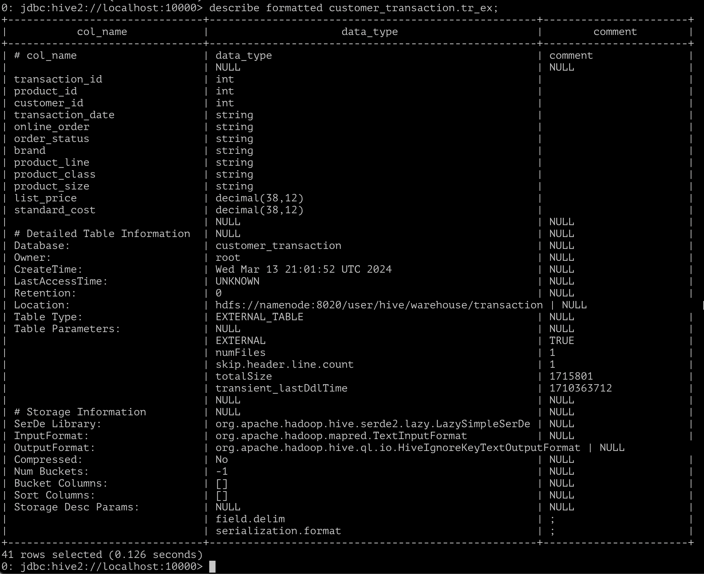

1) Скачиваем файлы и с помощью соответствующих команд загружаем их на HDFS.


2) С помощью соответствующих команд создаем над csv-файлами по 2 таблицы. Для transaction.csv:

```SQL
CREATE EXTERNAL TABLE IF NOT EXISTS customer_transaction.tr_ex (
    transaction_id    INT,
    product_id    INT,
    customer_id    INT,
    transaction_date STRING,
    online_order STRING,
    order_status STRING, 
    brand    STRING,
    product_line STRING,
    product_class    STRING,
    product_size    STRING,
    list_price    DECIMAL(38,12),
    standard_cost DECIMAL(38,12)
)
ROW FORMAT DELIMITED FIELDS TERMINATED BY ';' 
STORED AS textfile 
LOCATION 'hdfs://namenode:8020/user/hive/warehouse/transaction/'
TBLPROPERTIES ("skip.header.line.count"="1");
```

Аналогично повторяем со вторым файлом.

```SQL
CREATE EXTERNAL TABLE IF NOT EXISTS customer_transaction.cus_ex (
    customer_id    INT,
    first_name  STRING,
    last_name   STRING,
    gender STRING,
    DOB STRING,
    job_title   STRING,
    job_industry_category   STRING,
    wealth_segment  STRING,
    deceased_indicator  STRING,
    owns_car    STRING,
    address STRING,
    postcode    STRING,
    state   STRING,
    country STRING,
    property_valuation  INT
)
ROW FORMAT DELIMITED FIELDS TERMINATED BY ';' 
STORED AS textfile 
LOCATION 'hdfs://namenode:8020/user/hive/warehouse/customer/'
TBLPROPERTIES ("skip.header.line.count"="1");
```

Убеждаемся, что создание прошло успешно





3) Создадим еще две таблицы с форматом хранения данных PARQUET и загрузим данные из пункта 2. Сделаем это с помощью команды

```SQL
CREATE TABLE customer_transaction.tr_pq STORED AS PARQUET AS SELECT * FROM customer_transaction.tr_ex;
CREATE TABLE customer_transaction.cus_pq STORED AS PARQUET AS SELECT * FROM customer_transaction.cus_ex;
```

Убеждаемся, что все сработало корректно


4) Создадим исправленную таблицу tr_upd, в которой будут лежать данные таблицы tr_ex, но поле transaction_date будет типа DATE

```SQL

CREATE EXTERNAL TABLE IF NOT EXISTS customer_transaction.tr_ex_date (
    transaction_id    INT,
    product_id    INT,
    customer_id    INT,
    transaction_date DATE,
    online_order STRING,
    order_status STRING,
    brand    STRING,
    product_line STRING,
    product_class    STRING,
    product_size    STRING,
    list_price    DECIMAL(38,12),
    standard_cost DECIMAL(38,12)
);

INSERT INTO customer_transaction.tr_ex_date
SELECT
    transaction_id,
    product_id,
    customer_id,
    from_unixtime(unix_timestamp(tr_ex.transaction_date, 'dd.MM.yyyy')),
    online_order,
    order_status,
    brand,
    product_line,
    product_class,
    product_size,
    list_price,
    standard_cost
FROM customer_transaction.tr_ex;
```

Далее создадим еще одну таблицу tr_part, в которой данные будут партицированы по столбцу transaction_date и заполним ее с помощью команд

```SQL
CREATE EXTERNAL TABLE customer_transaction.tr_part (
    transaction_id    INT,
    product_id    INT,
    customer_id    INT,
    online_order STRING,
    order_status STRING,
    brand    STRING,
    product_line STRING,
    product_class    STRING,
    product_size    STRING,
    list_price    DECIMAL(38,12),
    standard_cost DECIMAL(38,12)
)
PARTITIONED BY (
    transaction_date DATE
);
INSERT INTO TABLE customer_transaction.tr_part PARTITION(transaction_date) SELECT * FROM customer_transaction.tr_pq;
```


5)

a) Вывести количество подтвержденных транзакций по каждому клиенту. Сдесь сравним формат хранения данных в таблицах (parquet и TextInputFormat). Сделаем это с помощью следующего запроса

```SQL
SELECT customer_id, count(t.transaction_id) AS transaction_count
FROM customer_transaction.tr_ex_date_pq t
RIGHT JOIN customer_transaction.cus_pq c
ON t.customer_id = c.customer_id
WHERE t.order_status == "Approved"
GROUP BY c.customer_id
LIMIT 20;

SELECT customer_id, count(t.transaction_id) AS transaction_count
FROM customer_transaction.tr_ex_date t
RIGHT JOIN customer_transaction.cus_ex c
ON t.customer_id = c.customer_id
WHERE t.order_status == "Approved"
GROUP BY c.customer_id
LIMIT 20;
```

Получаем следующий результат


Запрос для parquet-таблицы выполнился за 11.817 с, для TextInputFormat - за 10.767 с. На практике использование parquet более выгодно, чем TextInputFormat, и запросы к parquet-таблицам должны выполняться быстрее, однако в нашем случае этого не удалось пронаблюдать из-за малых размеров таблиц.


б) Выведем распределение транзакций по месяцам и сферам деятельности. В этом запросе сравним партицированную таблицу с обычной. К сожалению, в Hive не получилось просто перелить все данные в партиированную таблицу, так как выскакивала ошибка, поэтому совершим 50 операций по добавлению первых 100 строк в партицированную таблицу, а также заведем вспомогательную таблицу, в которую также добавим первые 100 строк 50 раз (почему-то для корректных результатов пришлось добавить 51 раз), назовем ее tr_test. Выполним следующие запросы

```SQL
SELECT month(t.transaction_date) AS month, c.job_industry_category AS sphere, count(t.transaction_id) AS transaction_count
FROM customer_transaction.tr_test t
LEFT JOIN customer_transaction.cus_ex c
ON t.customer_id == c.customer_id
GROUP BY month(t.transaction_date), c.job_industry_category
LIMIT 20;

SELECT month(t.transaction_date) AS month, c.job_industry_category AS sphere, count(t.transaction_id) AS transaction_count
FROM customer_transaction.tr_part t
LEFT JOIN customer_transaction.cus_ex c
ON t.customer_id == c.customer_id
GROUP BY month(t.transaction_date), c.job_industry_category
LIMIT 20;
```

Получаем результаты для партицированной таблицы 50.11 сек и 10.896 сек для обычной. Полученные результаты очень странны, потому что в теории запросы для партицированной таблицы должны работать быстрее.


в) Выведем ФИО клиентов, у которых нет транзакций. В этом запросе сравним MANAGED и EXTERNAL таблицы. Будем использоваться запрос

```SQL
SELECT c.first_name AS first_name, c.last_name AS last_name
FROM customer_transaction.cus_ex c
LEFT JOIN customer_transaction.tr_ex t
ON c.customer_id == t.customer_id
WHERE t.customer_id IS NULL
LIMIT 20;

SELECT c.first_name AS first_name, c.last_name AS last_name
FROM customer_transaction.cus_man c
LEFT JOIN customer_transaction.tr_man t
ON c.customer_id == t.customer_id
WHERE t.customer_id IS NULL
LIMIT 20;
```

Получаем результаты для EXTERNAL таблицы 10.871 сек и 10.25 сек для обычной, что примерно равно, откуда можем сделать вывод, что тип хранения не влияет (если это действительно так, а не следствие малого объема данных).


д) Выведем ФИО  клиентов с минимальной/максимальной суммой транзакций (sum(list_price)) за весь период (сумма транзакций не может быть null).

```SQL
-- get max(sum) InputTextFormat
SELECT tmp.first_name AS first_name, tmp.last_name AS last_name, tmp.total_price AS max_total_price FROM (
    SELECT c.first_name AS first_name, c.last_name AS last_name, sum(t.list_price) as total_price, rank() OVER (ORDER BY sum(t.list_price) DESC) rnk
    FROM customer_transaction.cus_ex c
    LEFT JOIN customer_transaction.tr_ex t
    ON c.customer_id == t.customer_id
    WHERE t.list_price IS NOT NULL
    GROUP BY c.first_name, c.last_name) AS tmp
WHERE tmp.rnk == 1;

-- get max(sum) parquet
SELECT tmp.first_name AS first_name, tmp.last_name AS last_name, tmp.total_price AS max_total_price FROM (
    SELECT c.first_name AS first_name, c.last_name AS last_name, sum(t.list_price) as total_price, rank() OVER (ORDER BY sum(t.list_price) DESC) rnk
    FROM customer_transaction.cus_pq c
    LEFT JOIN customer_transaction.tr_pq t
    ON c.customer_id == t.customer_id
    WHERE t.list_price IS NOT NULL
    GROUP BY c.first_name, c.last_name) AS tmp
WHERE tmp.rnk == 1;

--get min(sum) InputTextFormat
SELECT tmp.first_name AS first_name, tmp.last_name AS last_name, tmp.total_price AS min_total_price
FROM (
    SELECT c.first_name AS first_name, c.last_name AS last_name, sum(t.list_price) as total_price, rank() OVER (ORDER BY sum(t.list_price)) rnk
    FROM customer_transaction.cus_ex c
    LEFT JOIN customer_transaction.tr_ex t
    ON c.customer_id == t.customer_id
    WHERE t.list_price IS NOT NULL
    GROUP BY c.first_name, c.last_name) AS tmp
WHERE tmp.rnk == 1;

--get min(sum) parquet
SELECT tmp.first_name AS first_name, tmp.last_name AS last_name, tmp.total_price AS min_total_price
FROM (
    SELECT c.first_name AS first_name, c.last_name AS last_name, sum(t.list_price) as total_price, rank() OVER (ORDER BY sum(t.list_price)) rnk
    FROM customer_transaction.cus_pq c
    LEFT JOIN customer_transaction.tr_pq t
    ON c.customer_id == t.customer_id
    WHERE t.list_price IS NOT NULL
    GROUP BY c.first_name, c.last_name) AS tmp
WHERE tmp.rnk == 1;
```

Получили 14.728 сек на поиск максимума и 13.742 на поиск минимума для InputTextFormat и 13.144 сек и 12.782 соответственно для parquet. Полученные результаты слегка демонстрируют более высокую эффективность формата parquet.


е) Выведем ФИО клиентов, между соседними транзакциями которых был максимальный интервал (интервал вычисляется в днях)

```SQL
-- для InputTextFormat
SELECT c.first_name AS first_name, c.last_name AS last_name, tmp3.days_delta AS max_days_delta
FROM (
    SELECT tmp2.customer_id as customer_id, rank() over (ORDER BY tmp2.days_delta DESC) as rnk, tmp2.days_delta as days_delta
    FROM (
        SELECT tmp.customer_id as customer_id, max(tmp.days_delta) as days_delta
        FROM (
            SELECT t.customer_id, day(lead(t.transaction_date) OVER (PARTITION BY t.customer_id ORDER BY t.transaction_date) - t.transaction_date) as days_delta
            FROM customer_transaction.tr_ex_date t
            ) tmp
        WHERE tmp.days_delta IS NOT NULL
        GROUP BY tmp.customer_id
        ) tmp2
) tmp3
LEFT JOIN customer_transaction.cus_ex c
ON c.customer_id == tmp3.customer_id
WHERE tmp3.rnk == 1;

-- для parquet
SELECT c.first_name AS first_name, c.last_name AS last_name, tmp3.days_delta AS max_days_delta
FROM (
    SELECT tmp2.customer_id as customer_id, rank() over (ORDER BY tmp2.days_delta DESC) as rnk, tmp2.days_delta as days_delta
    FROM (
        SELECT tmp.customer_id as customer_id, max(tmp.days_delta) as days_delta
        FROM (
            SELECT t.customer_id, day(lead(t.transaction_date) OVER (PARTITION BY t.customer_id ORDER BY t.transaction_date) - t.transaction_date) as days_delta
            FROM customer_transaction.tr_ex_date_pq t
            ) tmp
        WHERE tmp.days_delta IS NOT NULL
        GROUP BY tmp.customer_id
        ) tmp2
) tmp3
LEFT JOIN customer_transaction.cus_pq c
ON c.customer_id == tmp3.customer_id
WHERE tmp3.rnk == 1;
```

Получаем 14.997 сек для InputTextFormat и 15.985 сек для parquet, что опять подтверждает то, что на таком количестве данных parquet не может продемонстрировать свою эффективность, в сравнении InputTextFormat.


